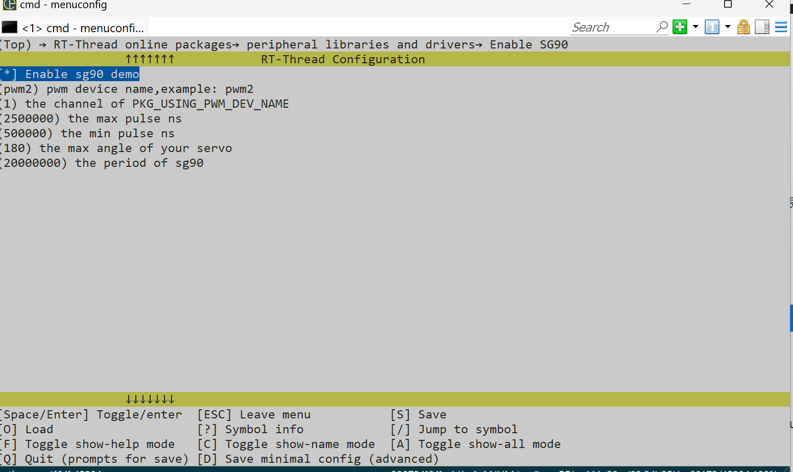
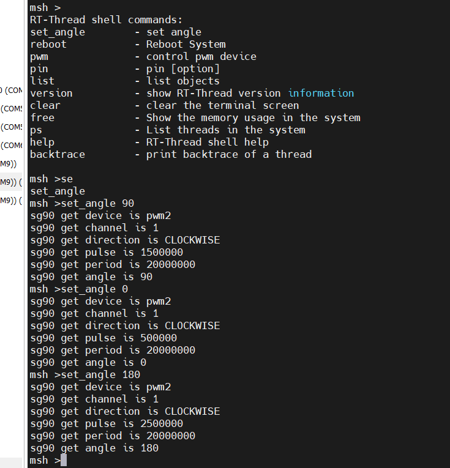

# Servo  in RT-Thread

> 在 RT-Thread 上对舵机进行控制


## 已经测试的舵机

- [x] sg90


## 使用方式

***首先确保已经正确使能pwm及其通道***


### MSH终端交互

> 首先进行使能



```c
//其宏定义如下

#define PKG_USING_PWM_DEV_NAME                "pwm2"          //PWM设备名称
#define PKG_USING_PWM_DEV_CHANNEL             1               //PWM通道
#define PKG_USING_MAX_ANGLE                   2500000         //最大角度 250000 ns
#define PKG_USING_MIN_ANGLE                   500000          // 最小角度 0 ns
#define PKG_USING_SG90_MAX_ANGLE             180              // 舵机最大角度


也可在sg90.h中进行修改
/*
//于kconfig 进行了定义，可在menconfig中进行修改。若不想从menuconfig修改，则解除该注释即可

#define PKG_USING_PWM_DEV_NAME                "pwm2"          //PWM设备名称
#define PKG_USING_PWM_DEV_CHANNEL             1               //PWM通道
#define PKG_USING_MAX_ANGLE                   2500000         //最大角度 250000 ns
#define PKG_USING_MIN_ANGLE                   500000          // 最小角度 0 ns
#define PKG_USING_SG90_MAX_ANGLE             180              // 舵机最大角度

*/
```

推出并保存配置，使用 ` pkgs --update ` 拉去软件包，编译运行；


### 使用示例

